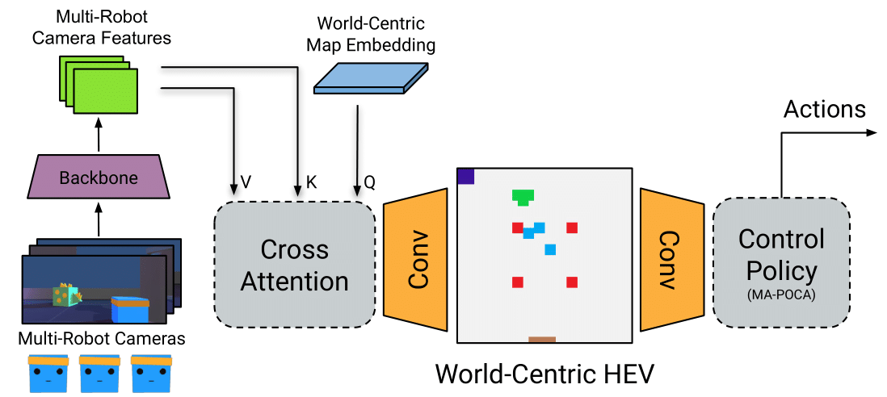
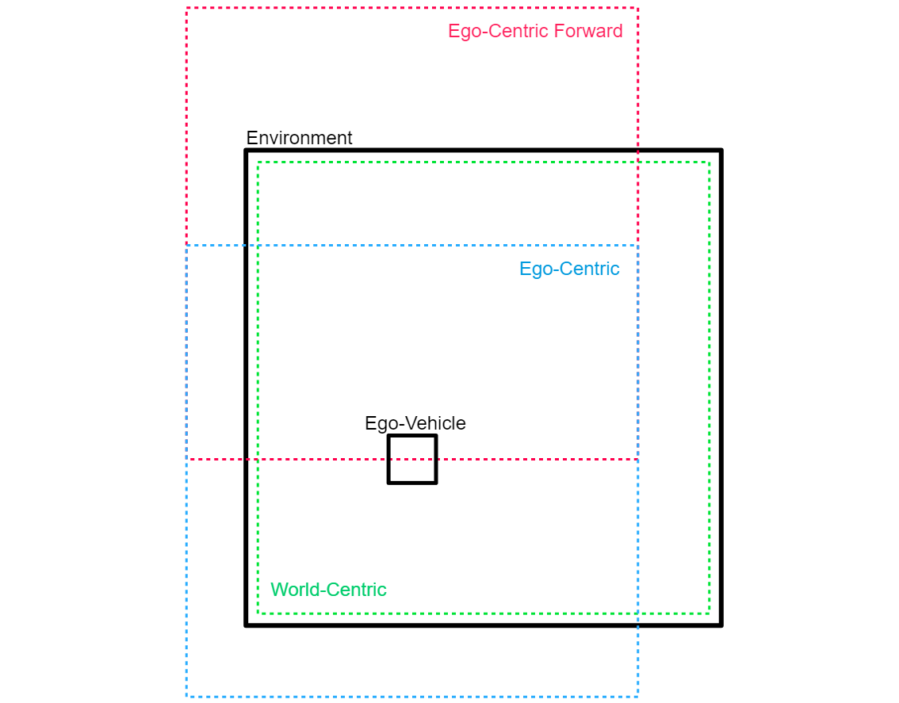
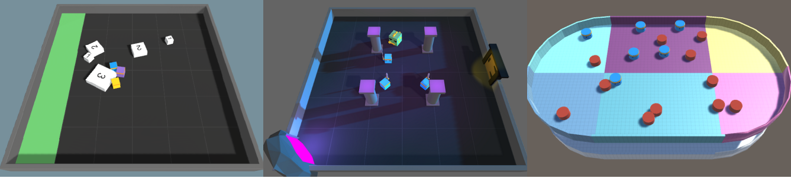
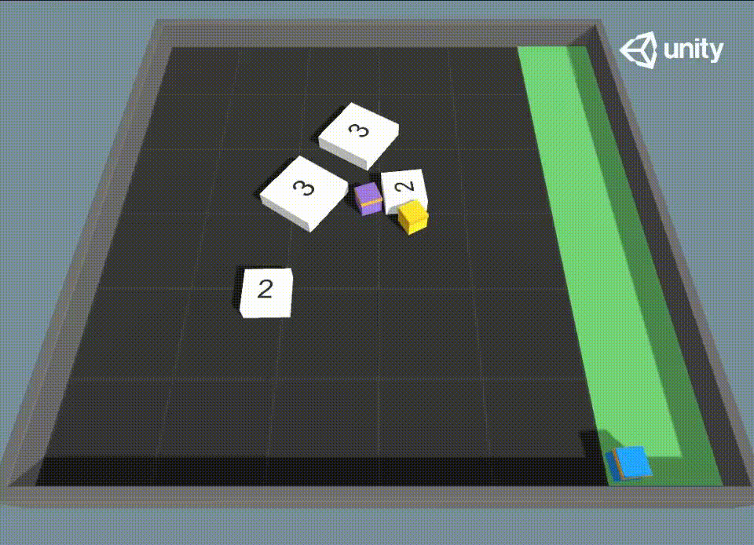

# Herd's Eye View: Improving Game AI Agent Learning with Collaborative Perception

## Introduction

In the realm of game AI, agents traditionally have access to extensive global information from the game engine. While this configuration assists in efficient decision-making, it doesn't accurately represent the restrictions encountered by AI applications outside of gaming. Game AI techniques that rely predominantly on game engine data may limit their potential contribution to broader AI applications.

To address these challenges, we present a novel paradigm named Herd’s Eye View (HEV) that adopts a global perspective derived from multiple agents to boost decision-making capabilities of reinforcement learning (RL) agents in multi-agent environments. The HEV approach utilizes cooperative perception to empower RL agents with a global reasoning ability, enhancing their decision-making.

## Herd's Eye View: A New Perspective

Drawing inspiration from autonomous vehicles research and the Bird’s Eye View (BEV) model, we propose a similar intermediary representation for game AI: the Herd’s Eye View (HEV) model. Unlike the BEV’s individual-centric perspective, the HEV model offers a shared world-centric perception derived from multiple agents. This shared perception model aligns closer to real-world AI applications, where multiple systems often work together to understand and navigate their environment.

The HEV model presents dual advantages. First, it mirrors the constraints faced by AI outside of gaming, contributing to the development of more believable AI behavior in games. Second, it alleviates the computational demands associated with the BEV model, where each agent maintains its own unique view of the environment. Instead, only a single shared global view is utilized.



## Perspective Views

### World-Centric (Herd's Eye View)

The world-centric view, also known as the Herd's Eye View (HEV), offers a shared global perception derived from multiple agents. This view allows all agents to have a comprehensive understanding of the entire environment, which can enhance their decision-making capabilities and coordination.

### Ego-Centric

The ego-centric view is an individual-centric perspective where each agent maintains its own unique view of the environment. This view can limit the agents' understanding of the environment to their immediate surroundings.

### Ego-Forward

The ego-forward view is a variation of the ego-centric view where the perspective is always forward-facing relative to the agent. This view can be limiting as it restricts the agents' perception to only what is in front of them.



## Key Contributions

Our work makes the following contributions:

1. We propose a baseline model for performing semantic segmentation in a fixed ”HEV” world-view.
2. We demonstrate the effectiveness of the HEV fixed world viewpoint in improving collaborative perception and MARL in games.

Our exploration of more realistic perception models and the application of reinforcement learning provides```markdown
significant insights for game AI development, stressing the wider applicability of these techniques beyond the gaming industry.

## Environments

### Collaborative Push Block

In this environment, agents are required to push white blocks to a designated green area. The challenge here is that larger blocks require more agents to push, necessitating cooperation and coordination among the agents.

### Dungeon Escape

This environment presents a unique challenge where agents must sacrifice one of their own to take down a green dragon and obtain a key. The rest of the team must then use this key to escape the dungeon. This scenario tests the agents' ability to strategize and make sacrifices for the greater good.

### Planar Construction

In the Planar Construction environment, six agents collaborate to push red pucks into desired positions. The positions can be random or static, and are observed via a Grid-Sensor, similar to the push block environment. This environment tests the agents' ability to work together in a more complex and dynamic setting.



## Experiments

### Accuracy of World-Centric Predictions vs Ego-Centric

The first experiment compares the accuracy of world-centric predictions using HEV with ego-centric predictions using BEV. We conduct this experiment in three simulated Multi-Agent Reinforcement Learning (MARL) game environments.

HEV-CVT validation IoU results per coordinate frame in each environment (higher is better)

| Environment              | World-Centric | Ego-Centric | Ego-Forward |
| ------------------------ | ------------- | ----------- | ----------- |
| Collaborative Push Block | 96.94%        | 63.87%      | 64.22%      |
| Dungeon Escape           | 43.53%        | 1.82%       | 26.07%      |
| Planar Construction      | 48.37%        | 35.45%      | 10.16%      |

### Efficiency of Perspective View Policies Learned

The second experiment evaluates the efficiency of policies learned by RL agents trained on HEV views compared to those trained on BEV views.

| Push Block Environment | Dungeon Escape Environment |
| :--------------------: | :------------------------: |
|  |    |

Table 2: MA-POCA mean episode length per coordinate frame in each environment (lower is better)

| Environment              | World-Centric | Ego-Centric | Ego-Forward |
| ------------------------ | ------------- | ----------- | ----------- |
| Collaborative Push Block | 222.6         | 246.6       | 230.5       |
| Dungeon Escape           | 14.15         | 16.74       | 23.27       |
| Planar Construction      | 110.5         | 120.3       | 149.9       |

## Conclusion

The Herd’s Eye View (HEV) framework offers a superior perception model in MARL environments, providing agents with a more comprehensive understanding of their surroundings, leading to improved decision-making and better overall performance. By using the HEV world-view collaborative perception problem, we show that the accuracy of collaborative perception models is significantly improved, leading to better IoU scores. Our work opens up new possibilities for advanced perception models in MARL, which can greatly enhance the performance of multi-robot systems by enabling better collaboration and coordination.

The code for this project is available on [GitHub](https://github.com/andrewnash/Herds-Eye-View).
