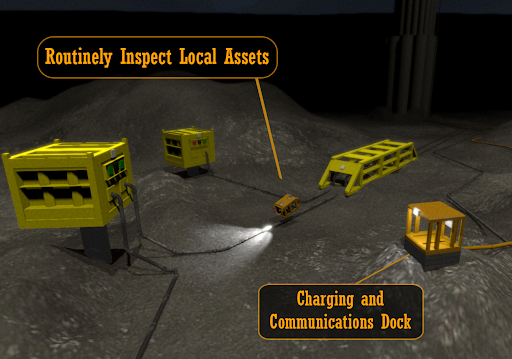
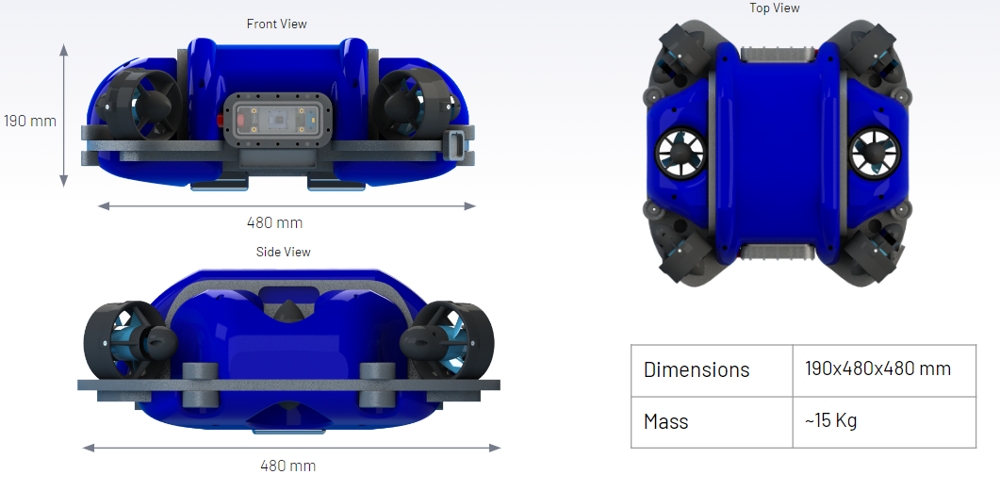
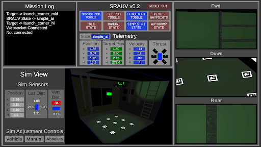
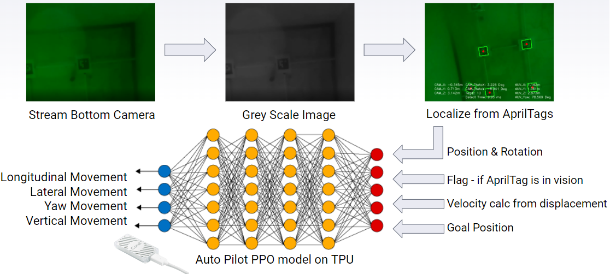
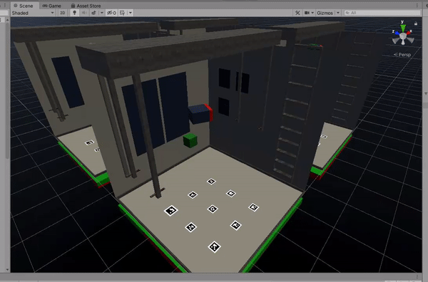
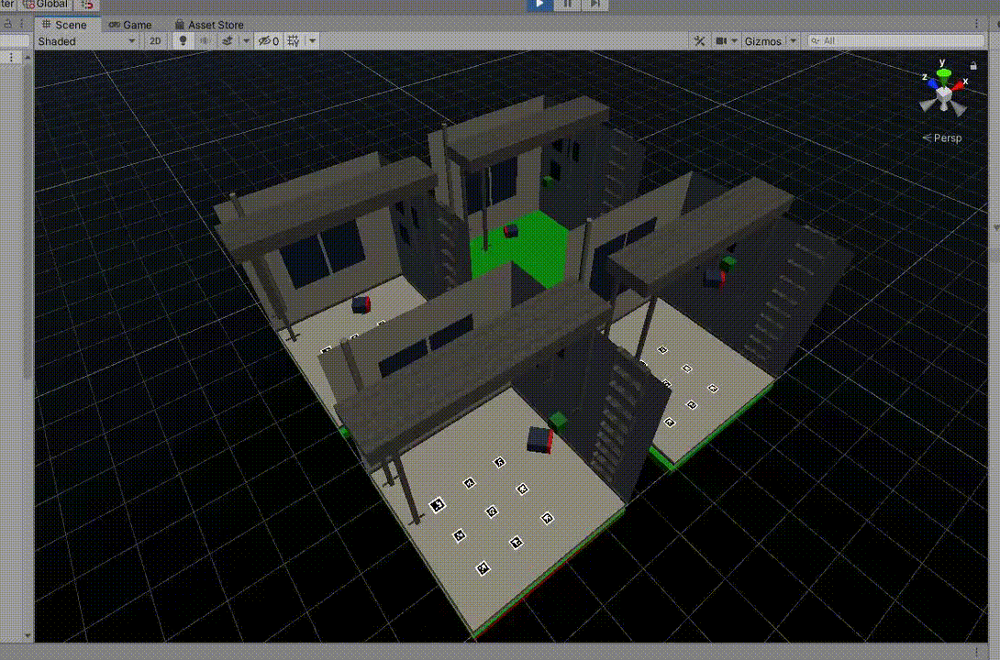
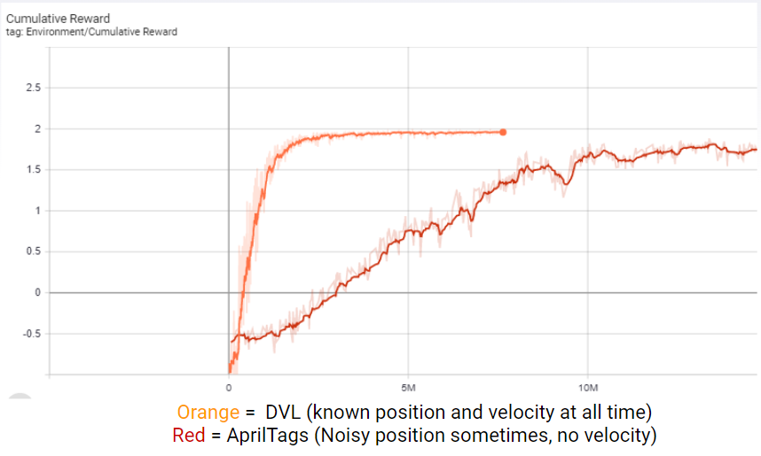
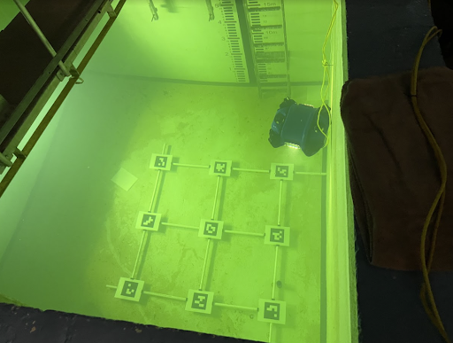
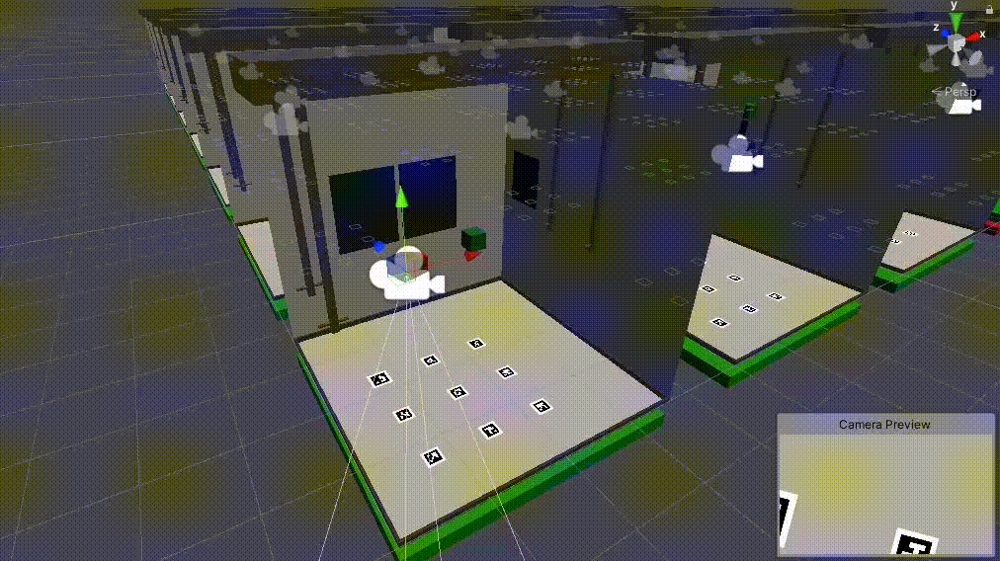
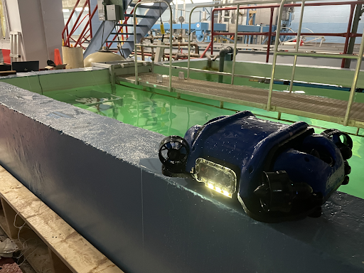

# Navigating the Depths with RL

Hello folks! My name is Andrew Nash, and I've been heavily involved in developing a software system for an Autonomous Subsea Vehicle, the SRAUV, as part of my engineering capstone project. In this blog post, I'll detail the work I did on the Autopilot/AI perception, navigation, and control. Strap in for an exciting journey deep beneath the waves!

<iframe width="560" height="315" src="https://www.youtube.com/embed/wzNI8wY0UT0" title="YouTube video player" frameborder="0" allow="accelerometer; autoplay; clipboard-write; encrypted-media; gyroscope; picture-in-picture; web-share" allowfullscreen></iframe>

## Introduction

In my capstone project, my team and I have tackled a pervasive problem in offshore oil and gas operations - consistent and reliable subsea monitoring. To address this, we've designed a prototype Subsea Resident Autonomous Underwater Vehicle (SRAUV). Our innovative SRAUV operates indefinitely under the sea, utilizing a dock on the seafloor that facilitates wireless charging and communication. It embarks on scheduled or on-demand inspection missions, collects vital data, and then returns to the dock to transmit this information. Through this approach, we're ushering in a new era of advanced offshore operations, with potential upgrades such as real-time anomaly detection that promises enhanced efficiency and safety.

## Vehicle

My exceptional teammates ensured the SRAUV's mechanical design adhered to principles of hydrodynamics, stability, and compactness, resulting in a sleek, efficient design. Fitting within the original constraints of a 2-foot length and width, the vehicle's overall mass is approximately 15 kg, as illustrated below. The team cleverly configured the thrusters to offer a versatile maneuverability, giving the SRAUV 5 degrees of freedom, though effectively using only 4 - excluding pitch and roll - for the project's final demonstration.

## Software Overview

The SRAUV software is a culmination of collaborative effort, using Unity 3D game engine for fast prototyping, extensive machine learning support, and engaging visual feedback. The interface is an all-in-one GUI Simulator, allowing the user to control the vehicle, visualize thruster direction feedback, and simulate various environmental conditions. All software for the project is openly available on Github.

## Simulator

We developed a Unity-based simulator that accurately mimics the mechanics of the SRAUV. This simulator applies individual thrust vectors at each thruster's respective angle, fine-tuning its underwater movement, often referred to as "driftyness", to reflect the real-world feedback from experienced pilots. The simulation updates in response to these thrust commands, providing new sensor data which includes the SRAUV's position and the relative locations of assets in the environment. This helped us efficiently and accurately test our autonomous flying solutions.

## Model Training

In addition to the main simulator, I created a lighter "ML Tank" for training the DRL algorithms. This environment include a significantly reduced polygon count, a necessary optimization since DRL algorithms are computationally expensive to simulate. Further speed enhancements were achieved by including multiple ML Tanks, allowing multiple agents to collect observations simultaneously, this can be seen below.

Screenshot of 49 ML Tanks training simultaneously within the Unity environment. 

## Autonomous Strategy

As the core designer of the Autopilot, I initially considered employing Q-learning for the SRAUV's control system. This approach was favored due to its popularity and well-documented success. However, throughout the model selection process, I found Deep Reinforcement Learning (DRL) to be the most effective at driving in the simulator. I utilized Unity ML-Agents Toolkit for DRL training within the Unity simulator, leading to rapid experimentation with the SRAUV's Flight Computer and Vision System.

With DRL, I designed an end-to-end solution for our control system. This allowed observations to go into the model and thrust control to emerge, providing optimal control of the SRAUV through a variety of unpredictable scenarios.

## Model Development

For model training, I used a simplified subproblem - driving from a random X, Y, Z position to another random position as quickly as possible. I then tested various DRL solutions on these subproblems, progressively introducing complexity until the environment closely mirrored real life. This iterative approach allowed for significant improvement during model development.

### Model Selection

For the SRAUV control system, I considered both discrete and continuous action spaces. While a continuous action space implies real numbers for the DRL model output, a discrete one implies a fixed set of categories. I experimentally found discrete to be more effective during training. I benchmarked the Soft Actor-Critic (SAC) model against a Proximal Policy Optimization (PPO). SAC took a considerable time to train and often failed to reach the goal consistently. On the other hand, PPO found the optimal driving strategy faster and more effectively, which led to its selection for further development.

### Reward Structure

The reward structure found to best solve the easy environment was relatively straightforward, consisting of three different rewards. The first reward was assigned as +1 when the agent arrived within a predefined tolerance of its goal waypoint. The second reward was the negative inverse of maximum time steps -0.002, this small negative reward assigned every timestep encouraged the model to drive to the goal as fast as possible. Finally, the third reward sets the overall reward to -1 if the agent collides with anything, this also resets the run for increased training speed.

In further iterations of the training environment, I found that the agent would sometimes overshoot its goal position and accidentally crash into a wall, to help mitigate this problem a stacking negative reward was assigned whenever the agent exceeded 0.3 m/s velocity in any axis of movement. This resulted in reduced crashing and taught the model to operate at a reduced speed when nearing its goal position.

### Curriculum Learning

Since the PPO algorithm struggled to converge when tolerances of less than 40cm were used in training, I utilized curriculum learning to overcome this challenge. This technique allowed me to progressively decrease the tolerance required to reach the goal waypoint during training, significantly enhancing the model's performance.

## Localization

After our initial approach for localization, which relied on a combination of a pressure sensor, time-of-flight (TOF) sensors, and an inertial-measurement-unit (IMU), failed to meet expectations, my team and I were forced to quickly pivot. Due to issues ranging from faulty TOF sensors, an unsteady IMU, and a malfunctioning depth sensor, we had to reimagine our solution, leading us to the exploration of a computer vision-based approach. Utilizing AprilTags, similar to simple QR codes, we established a localization system that successfully tracked the position and rotation of the SRAUV relative to the tank. We installed a grid of these AprilTags on the tank floor, ensuring the bottom camera of the SRAUV was able to constantly locate a tag, significantly improving our vehicle's spatial awareness. Impressively, this solution not only worked exceedingly well during testing, achieving an accuracy of about +-5 cm in position and +-5 degrees in heading, but it was also considerably more cost-effective than our initial sensor plan.

The AprilTags detection in the ML Tank was another area I optimized. Running the vision recognition on all 49 tanks in a single environment would have been computationally prohibitive. To address this, I added a camera with matching intrinsic parameters and position to the SRAUV's bottom pi cam in the simulator. This allowed me to check if the AprilTag was in the camera's frame during each timestep, providing the agent with the most recently known position & velocity estimate, simulating the noisy conditions it would face in the real world.

## Real World Testing

Below you can see some videos of real world testing the SRAUV in a tank at Memorial University.

## Conclusion

Wrapping up, I am incredibly proud of the progress and achievements made by my team and myself throughout our capstone project. We successfully designed, implemented, and tested a neural network-based autopilot for our Subsea Resident AUV (SRAUV) prototype. This enabled the SRAUV to perform autonomous missions, including navigating a prescribed route and redocking, a significant milestone for us. Even though we faced setbacks, such as hardware failures limiting the testing of an improved autopilot model, these challenges only fueled our drive to innovate. Our commitment paid off, winning us first place in all capstone award categories. We believe our work has set a strong foundation for future developments in autonomous subsea navigation.

Capstone Trailer (Awarded best video)

<iframe width="560" height="315" src="https://www.youtube.com/embed/v3Z9sVuU5DQ" title="YouTube video player" frameborder="0" allow="accelerometer; autoplay; clipboard-write; encrypted-media; gyroscope; picture-in-picture; web-share" allowfullscreen></iframe>

IEEE Night Presentation (Awarded best Presentation)

<iframe width="560" height="315" src="https://www.youtube.com/embed/UXqgjFvW4HE" title="YouTube video player" frameborder="0" allow="accelerometer; autoplay; clipboard-write; encrypted-media; gyroscope; picture-in-picture; web-share" allowfullscreen></iframe>

